# PayFlow: Real-Time Payments CDC Lakehouse

Change Data Capture pipeline for a (fictional) payment processor. Every insert, update and delete in a
Postgres payments database streams through **Debezium** and **Kafka** into Parquet landing files, then into a
**Databricks Delta Lake** (bronze → silver → gold). Silver is reconciled against the source to the cent, quality-checked
against ground truth, orchestrated by **Airflow**, and served to finance and risk teams in **Tableau**.

**Stack:** PostgreSQL 16 · Debezium 2.7 · Apache Kafka 3.9 (KRaft) · Python 3.11 · Parquet · DuckDB ·
Databricks (Delta Lake, Auto Loader, Unity Catalog) · PySpark · Apache Airflow 2.10 · Tableau · Docker · GitHub Actions

The full design doc (decisions, tradeoffs, interview prep) is [`PayFlow_CDC_Project.md`](PayFlow_CDC_Project.md).

---

## 0. Project status

| Phase | What | Status |
|---|---|---|
| 0 | Machine setup (Docker, Python 3.11, Java 17) | ✅ Done |
| 1 | Capture: Postgres → Debezium → Kafka → Parquet | ✅ Done and verified (0 loss, 463K events) |
| 2 | Upload + deploy to Databricks | ⏳ **TODO:** needs Databricks credentials ([§4](#4-todo-running-the-databricks-half)) |
| 3 | Lakehouse bronze / silver / gold | 🟡 Logic verified on local Spark; **TODO:** run in Databricks |
| 4 | Data quality + reconciliation | 🟡 Verified locally (100 % catch, 0 mismatches); **TODO:** `make reconcile` against Databricks |
| 5 | Airflow | 🟡 DAGs load, 5 DAG tests pass, slot check runs; **TODO:** 3 green `payflow_lakehouse` runs (needs Databricks) |
| 6 | Tableau dashboards | ⏳ **TODO** ([§8](#8-todo-tableau)) |
| 7 | CI (GitHub Actions) | 🟡 Workflow written; **TODO:** push to GitHub ([§9](#9-todo-ci-on-github)) |
| 8 | Chaos tests + benchmark | ✅ Done (12/12 runs, 0 loss; ≥ 3,293 events/s) |

---

## 1. Results (measured, not targets)

Measured on **2026-10-05/06** on an Apple M5 Pro laptop (24 GB RAM), Docker via Colima (6 CPUs / 10 GB),
single Kafka broker. Laptop numbers. See [§7](#7-honest-limitations).

| # | Metric | Measured | How |
|---|---|---|---|
| 1 | Change events captured | **463,339** CDC events (inserts, updates, deletes) | `make check` |
| 2 | Simulated payments processed | **193,640 payments, $12,863,124.83** | `make local-lakehouse` |
| 3 | Sustained throughput | **≥ 3,293 events/s** with consumer lag back to **0** within 35 s. Generator-bound: the pipeline's ceiling was not reached | `make bench` (16 generator procs) |
| 4 | Capture latency (commit → Parquet), steady state | **p50 1.5 s · p95 16.5 s · p99 30.2 s · max 31.9 s** (386,666 events, 30 s flush) | `make check` latency block |
| 5 | Zero loss under failure | **0 lost rows across 12 fault-injection runs** (4 scenarios × 3) | `scripts/chaos/run_chaos.sh` + `verify_no_loss.py` |
| 6 | Duplicates removed | **602** redelivered events in bronze (201 / 204 / 197 per `crash_before_commit` run) → **0** in silver | chaos + `local_lakehouse.py` |
| 7 | Debezium outage recovery | 60 s outage, **1.6–3.7 MB** WAL held, caught up in **64 s** (all 3 runs; dominated by Kafka Connect's restart time), 0 loss | `stop_connect` summary |
| 8 | Schema drift | `ALTER TABLE payments ADD COLUMN risk_score` mid-stream: bronze unaffected, drift detected, 0 loss | `schema_drift` scenario |
| 9 | Reconciliation to the cent | **0 mismatches** (full: 16 checks; daily: 3 checks), $12.86M compared | `local_lakehouse.py` → `reconcile.compare` |
| 10 | DQ catch rate | **749 / 749 = 100 %** of injected bad records, **0 false positives** | ground truth vs `dq_rules_sql` |
| 11 | SCD2 history | **6,130** historical merchant versions (8,503 total) | `gold.dim_merchant_scd2` |
| 12 | Replay determinism | gold totals **identical** after rebuilding from events with 20 % re-delivered + shuffled | `local_lakehouse.py` step 5 |
| 13 | Replication-slot lag with Airflow writing to the same server | **0.08 MB** (heartbeat keeps the slot moving) | Airflow `check_replication_slot` |
| 14 | Tests | **39 automated tests** (34 unit + local Spark, 5 DAG integrity against real Airflow 2.10.5) | `make test` + DAG tests |

**Not yet measured** (needs a Databricks workspace; see [§4](#4-todo-running-the-databricks-half)): end-to-end freshness
from `ops.pipeline_runs`, file compaction (`ops.maintenance_runs`), and the daily-reconciliation streak over several days.
Rows 9–12 were measured by running the **same `transforms.py` functions** on local Spark over the real landed data.
The Delta MERGE code path itself only runs in the workspace.

Chaos run logs: `chaos_logs/<scenario>-<timestamp>/` (`verify.txt`, `landing.txt`, `summary.txt`).
Lakehouse numbers: `local_lakehouse/results.json`.

---

## 2. Architecture

```mermaid
flowchart LR
    SIM[Simulator<br/>payments app] -->|SQL| PG[(Postgres<br/>wal_level=logical)]
    PG -->|WAL via<br/>replication slot| DBZ[Debezium<br/>Kafka Connect]
    DBZ -->|1 msg per row change<br/>keyed by PK| K[(Kafka<br/>5 topics x 3 partitions)]
    K --> C[Landing consumer<br/>at-least-once]
    C -->|atomic Parquet files| L[/landing/]
    L -->|Airflow: upload| V[/Databricks Volume/]
    V -->|Auto Loader| B[(bronze.cdc_events)]
    B -->|dedupe + LSN-ordered MERGE| S[(silver: history, state, views)]
    S -->|DQ rules| Q[(ops.dq_results)]
    S --> G[(gold: SCD2, lifecycle,<br/>settlement, risk)]
    Q --> G
    G --> T[Tableau]
    PG -.->|reconcile to the cent| R{{Airflow<br/>reconciliation}}
    S -.-> R
```



1. **Capture:** Debezium reads the Postgres WAL (`pgoutput`, `REPLICA IDENTITY FULL`) and publishes one JSON
   event per row change, keyed by primary key, so per-row order is preserved.
2. **Land:** the consumer buffers events and writes Parquet atomically (`.tmp` → rename) **before** committing
   Kafka offsets. A crash causes duplicates, never loss.
3. **Bronze:** Auto Loader (`availableNow`) appends each file once. The raw JSON is kept, so it is replayable.
4. **Silver:** dedupe on `(topic, partition, offset)`, insert-only history MERGE, state MERGE only if the event is newer by
   `(LSN, offset)`, deletes as **tombstones**, emails SHA-256 hashed, schema drift logged.
5. **Quality:** 6 rules flag bad rows (kept in silver, excluded from finance gold), scored against the simulator's ground truth.
6. **Gold:** SCD2 merchant dimension, payment lifecycle, daily settlement with **point-in-time fees** per currency, 30-day risk.
7. **Ops:** Airflow checks slot lag, uploads, runs the job, checks freshness; reconciles daily; compacts weekly; replays on demand.

---

## 3. Quick start (local, no cloud account needed)

Prerequisites: Docker with ~8 GB RAM, Python 3.11+, Java 17 (only for Spark tests / `local-lakehouse`).

```bash
make install                 # 1. venv + deps   (macOS default python3 is 3.9: use make install PYTHON=python3.11)
make up                      # 2. Postgres, Kafka, Debezium, Kafka UI (http://localhost:8085)
make register                # 3. Debezium connector; waits until connector + task are RUNNING
make simulate                # 4. terminal 2: payments traffic (Ctrl+C to stop)
make consume                 # 5. terminal 3: Kafka -> landing/*.parquet (Ctrl+C to stop)
# ...let it run, Ctrl+C the simulator, wait ~35 s, Ctrl+C the consumer
make check                   # 6. counts, duplicates, latency, file sizes, dead letters
make verify                  # 7. zero-loss proof: Postgres vs landed events, row by row
make test                    # 8. ruff + unit + local Spark tests
make local-lakehouse         # 9. silver/quality/gold on local Spark + reconcile vs Postgres
```

Chaos and benchmark (stack up, connector registered, nothing else running):

```bash
make chaos                   # kill_consumer, crash_before_commit, stop_connect, schema_drift
make bench                   # needs `make consume` running in another terminal
```

Airflow (http://localhost:8080, user `admin`):

```bash
make airflow-up
docker exec payflow-airflow cat /opt/airflow/standalone_admin_password.txt
# Postgres volume created before 03_airflow_db.sql existed? Run it once (it's idempotent):
docker exec payflow-postgres psql -U payflow -d payflow -f /docker-entrypoint-initdb.d/03_airflow_db.sql
```

Clean up: `make down` (keeps Postgres data) or `make reset` (wipes containers, volumes, landing files).

---

## 4. TODO: running the Databricks half

**Step 1: Account (one time)**
- [ ] Sign up for **Databricks Free Edition** (not the trial).
- [ ] Catalog → + → Create catalog `payflow`. If Free Edition won't allow it, use `workspace` and set `PAYFLOW_CATALOG=workspace`.
- [ ] Settings → Developer → Access tokens → Generate (or run `databricks auth login`).
- [ ] SQL Warehouses → your warehouse → Connection details → copy the **HTTP path**.
- [ ] Check: the SQL editor runs `SELECT 1`.

**Step 2: Configure**
```bash
cp .env.example .env         # fill in DATABRICKS_HOST, DATABRICKS_TOKEN, DATABRICKS_HTTP_PATH (PAYFLOW_CATALOG if needed)
```

**Step 3: Bring the local stack back up** (skip if it's still running)
```bash
make up && make register     # Postgres, Kafka, Debezium; connector RUNNING
```

**Step 4: Deploy and run the job**
```bash
make deploy                  # 10. uploads notebooks + transforms.py, creates job "payflow-lakehouse"
make upload                  # 11. landing/ + landing_archive/ files -> /Volumes/<catalog>/raw/files/landing/
```
- [ ] Databricks → Workflows → `payflow-lakehouse` → **Run now**. The first run creates every schema, volume and table.
- [ ] Check: `SELECT COUNT(*) FROM payflow.bronze.cdc_events` equals the `total_rows` from `make check`.
- [ ] Check: all four `payflow.gold.*` tables have rows.

Note: `make upload` only sends files still in `landing/`. To re-send everything already archived, move
`landing_archive/*` back into `landing/` first (re-uploading is safe: Auto Loader skips known paths and silver dedupes).

**Step 5: Airflow schedule**
```bash
make airflow-up
docker exec payflow-airflow cat /opt/airflow/standalone_admin_password.txt   # login: admin
```
- [ ] Unpause `payflow_lakehouse` at http://localhost:8080 and keep `make simulate` + `make consume` running.
- [ ] Wait for **3 consecutive green runs** (every 30 min).

**Step 6: Reconcile**
```bash
# stop the simulator, let one payflow_lakehouse run finish, then:
make reconcile               # 13. must print "0 mismatches" and exit 0
```

**Step 7: Measure the remaining numbers and add them to [§1](#1-results-measured-not-targets)**
```sql
-- end-to-end freshness (metric 5)
SELECT AVG(latency_p50_s), AVG(latency_p95_s) FROM payflow.ops.pipeline_runs;
-- reconciliation streak (metric 9): let the daily DAG run for several days first
SELECT COUNT(*), SUM(mismatches) FROM payflow.ops.reconciliation_runs WHERE mode = 'daily';
-- DQ catch rate in Databricks (metric 10)
SELECT * FROM payflow.ops.dq_catch_rate_history ORDER BY run_ts DESC LIMIT 1;
-- small-file compaction (metric 11): trigger payflow_maintenance in Airflow first
SELECT * FROM payflow.ops.maintenance_runs ORDER BY run_ts DESC;
-- duplicates: bronze may have some, silver must have 0
SELECT COUNT(*) - COUNT(DISTINCT _kafka_topic, _kafka_partition, _kafka_offset) FROM payflow.bronze.cdc_events;
SELECT COUNT(*) - COUNT(DISTINCT _kafka_topic, _kafka_partition, _kafka_offset) FROM payflow.silver.payments_history;
-- schema drift from the chaos runs was recorded
SELECT * FROM payflow.ops.schema_drift_events;
```
- [ ] Replay determinism in Databricks: note the totals below, trigger `payflow_replay` in Airflow, run it again, and compare.
```sql
SELECT currency, SUM(gross_cents), SUM(fee_cents), SUM(net_cents)
FROM payflow.gold.daily_merchant_settlement GROUP BY currency;
```

---

## 5. Repository layout

```
docker-compose.yml               Postgres, Kafka, Debezium, Kafka UI, Airflow
Makefile                         numbered one-word commands (CI uses the same ones)
postgres/init/                   01 schema · 02 Debezium user, heartbeat, publication · 03 Airflow DB
connectors/register_connector.py Debezium config, every setting commented
simulator/simulator.py           payments traffic + bad-data injection + ground-truth log
consumer/consumer.py             Kafka -> Parquet, at-least-once, atomic writes, dead-letter
uploader/upload_to_volume.py     landing -> Databricks Volume -> local archive
payflow_common/connections.py    Postgres + Databricks SQL helpers
databricks/deploy.py             uploads notebooks, creates/updates the job
databricks/notebooks/            transforms.py (all logic, unit tested) + 00_setup … 04_gold
reconciliation/reconcile.py      Postgres vs silver, to the cent (daily + full modes)
airflow/dags/                    payflow_lakehouse (every 30 min) + payflow_ops (reconcile, maintenance, replay)
scripts/                         check_landing · verify_no_loss · benchmark_throughput · local_lakehouse · chaos/run_chaos.sh
tests/                           consumer · pipeline logic · Spark transforms · DAG integrity
.github/workflows/ci.yml         unit, DAG, and real end-to-end CDC test
```

Every source file opens with a docstring covering its **why**, its numbered **steps**, and the **edge cases handled**.

---

## 6. Edge cases handled (beyond the original spec)

Each of these was found while building and running the project end to end:

| # | Where | Problem | Fix |
|---|---|---|---|
| 1 | `docker-compose.yml` | The unpinned Databricks provider pulled a version that requires Airflow 3; pip **uninstalled Airflow 2.10.5** and the container died (`airflow: not found`) | Pin `apache-airflow==2.10.5` in `_PIP_ADDITIONAL_REQUIREMENTS` |
| 2 | `02_cdc_setup.sql`, connector | With the payment tables idle and Airflow writing to the same server, the slot holds WAL forever, so the slot-lag alert fires falsely | Heartbeat table + `heartbeat.action.query` (measured: 0.08 MB lag) |
| 3 | `simulator.py` | Concurrent simulators could move a payment backwards (refunded → failed), creating **DQ false positives** | Every state change is `UPDATE … AND status = <expected>`; refunds are inserted only if the claim succeeded |
| 4 | `simulator.py` | Bad rows were logged to ground truth **before** commit; a rollback would leave a phantom "injected" record | Logged only after commit |
| 5 | `simulator.py` | `Faker.unique` raises once values run out on long runs; `--rate 0` divides by zero; a Postgres restart crashed it | Counter-suffixed emails, CLI validation, reconnect with backoff |
| 6 | `consumer.py` | `_ingested_at` was stamped at poll time, so latency left out the flush wait | Stamped at file-write time |
| 7 | `consumer.py` | Partial flush failure, rebalance, non-fatal broker errors, poison messages, orphaned `.tmp` files | Per-table buffer release, `on_revoke` flush+commit, fatal-only exit, dead-letter, stale `.tmp` cleanup |
| 8 | `transforms.py` | First SCD2 version opened at the **snapshot** time, so earlier captures got a NULL fee and overstated net | First version opens at `created_at` |
| 9 | `00_setup` / `01_bronze` | Auto Loader schema inference fails on an empty landing folder (first run) | Explicit schema; bronze table and landing folder pre-created |
| 10 | `02_silver` | `silver.disputes` doesn't exist until the first dispute arrives, so quality/gold SQL crashed | Every silver table and view is created even when it has no events |
| 11 | `03_quality` | Replay kept stale flags from old rules | `full_refresh` rebuilds `ops.dq_results` |
| 12 | Lakehouse DAG | Missing slot reported "lag 0"; freshness was skipped exactly when the consumer was dead; idle source = false freshness alarm | Fail on missing slot; freshness always runs (`none_failed`); lag measured against Postgres' newest change |
| 13 | `reconcile.py` | Mismatch details pasted into SQL; session time zone not pinned | Bound parameters; Postgres session `SET TIME ZONE 'UTC'` |
| 14 | `uploader` | Upload order by mtime alone is non-deterministic (flaky test); files vanishing mid-run | (mtime, path) order; vanished files skipped |
| 15 | Spark tests | Workers launched the PATH `python3` (3.9) instead of the venv (3.11) | `PYSPARK_PYTHON = sys.executable` |
| 16 | Chaos script | Ctrl+C left processes running; unbounded catch-up loop; a dead consumer aborted verification | `trap` cleanup, 180 s bound, tolerant kill |
| 17 | `03_airflow_db.sql` | Running it by hand twice failed | Idempotent (`DO` block + `\gexec`) |
| 18 | `verify_no_loss.py` | Merchant updates (the SCD2 input) weren't verified | Compares `risk_tier|fee_bps` too |

---

## 7. Honest limitations

- **Synthetic data.** Business insights (chargeback rates, top merchants) are fictional. The engineering is real.
- **Single-node everything.** One Kafka broker (replication factor 1), one Airflow container. Numbers are laptop numbers.
- **Databricks not yet run here.** Lakehouse logic was measured on local Spark with the same `transforms.py`; the Delta MERGE,
  Auto Loader and job wiring only run in the workspace (no credentials were available for this run).
- **Micro-batch freshness.** End-to-end freshness is bounded by the 30-minute Airflow schedule (Free Edition constraints).
- **Snapshot timestamps.** Rows read by Debezium's initial snapshot carry the snapshot time, so their lifecycle timestamps are approximate.
- **No FX.** Settlement is reported per currency.
- **PII.** Raw emails remain in bronze JSON; true erasure needs bronze retention + VACUUM or crypto-shredding.
- **DQ flags are never resolved.** A record fixed later in the source stays flagged (until a replay).
- **Throughput is a floor.** 3,293 events/s was limited by the load generator, not the pipeline.
- **Airflow 2.10.** Airflow 3 is the current line; the DAGs use the TaskFlow API and should port with minor changes.

---

## 8. TODO: Tableau

Needs the Databricks gold tables from [§4](#4-todo-running-the-databricks-half). Full spec: design doc, Phase 6.

- [ ] Install Tableau Desktop (Tableau for Students) and the Databricks ODBC driver; create a Tableau Public account.
- [ ] Connect → Databricks: server = workspace host (no `https://`), HTTP path = the warehouse's, auth = personal access token. Use **Extract**, not Live.
- [ ] Calculated fields: `[Gross $] = SUM([gross_cents])/100`, plus the same for Fees, Refunds, Chargebacks (`dispute_lost_cents`) and Net; `[Take rate] = SUM([fee_cents])/SUM([gross_cents])`.
- [ ] **Finance** (`gold.daily_merchant_settlement`): KPI tiles with a Currency filter, daily Gross vs Net, top 10 merchants by Net, running balance per merchant.
- [ ] **Risk** (`gold.merchant_risk_30d`, `ops.dq_results`): volume vs chargeback-rate scatter, flagged records by rule, merchants above 1 % chargebacks.
- [ ] **Pipeline health** (`ops.pipeline_runs`, `ops.reconciliation_runs`, `ops.dq_catch_rate_history`, `ops.maintenance_runs`).
- [ ] File → Save to Tableau Public, then paste the link and screenshots here:

> Tableau Public: _link here_


