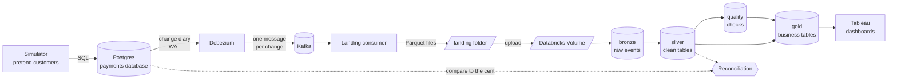

# PayFlow: Real-Time Payments CDC Lakehouse

PayFlow is a pretend payment company, and this project builds the data pipeline such a company actually needs: every time
a payment is created, refunded, disputed or changed in the production database, that change is captured within seconds,
shipped to a data lakehouse, cleaned, checked, and turned into the numbers finance and risk teams use, and then
**proven correct to the cent** against the original database.

**Stack:** PostgreSQL 16 · Debezium 2.7 · Apache Kafka 3.9 (KRaft) · Python 3.11 · Parquet · DuckDB ·
Databricks (Delta Lake, Auto Loader, Unity Catalog) · PySpark · Apache Airflow 2.10 · Tableau · Docker · GitHub Actions

The long-form design document (every decision and its tradeoffs, plus the full source) is
[`PayFlow_CDC_Project.md`](PayFlow_CDC_Project.md). This README is the story version.

---

## At a glance

The pipeline works end to end. Data flows from a local Postgres database, through Kafka, into a real Databricks workspace,
and the finished tables there match the source database exactly: **$12,863,124.83 of payments, 0 mismatches**. It has
been deliberately broken twelve different ways without losing a single row.

---

## The problem, in plain words

A payment company's main database is built for one job: taking payments fast. It is not built for questions like
*"how much did each merchant earn yesterday, after fees and refunds?"* or *"which merchants have suspiciously many
chargebacks?"* Running heavy reports against it would slow down real customers.

So companies copy the data somewhere else, an **analytics lakehouse**, and answer questions there. The naive way is to copy
the whole database every night. That is slow, the numbers are a day old, and it loses history: if a payment went
`pending → captured → refunded` during the day, a nightly copy only sees `refunded`.

The better way is **Change Data Capture (CDC)**: instead of copying tables, you listen to the database's own diary of
changes and forward every single insert, update and delete as it happens. That is what this project does.

---

## Follow one payment through the system



Imagine a customer pays a coffee shop $4.50. Here is everything that happens to that payment.

### 1. It is born in Postgres

`simulator/simulator.py` plays the role of the payment company's app. It creates merchants and customers, takes payments,
captures them, refunds some, and opens disputes on others, at whatever rate you choose. It also **deliberately injects
bad data** (about 2% of records: negative amounts, unknown currencies, impossible state changes) and writes down
exactly which records it broke in `simulator/injected/bad_records.jsonl`. That file is the answer key later used to
grade the quality checks.

Our $4.50 payment lands in the `payments` table with status `pending`. A moment later the simulator updates it to
`captured`.

### 2. Debezium notices the change

Every serious database keeps a write-ahead log (**WAL**): a diary where it records each change *before* applying it,
so it can recover after a crash. Postgres can share that diary with outside readers through a **replication slot**.

**Debezium** (`connectors/register_connector.py`) is such a reader. It reads the diary and turns each change into a
JSON message: *"row 81723 in payments changed from pending to captured, here is the full before and after."* It does
not query the tables, so it puts almost no load on the database.

One subtle trap: if the payment tables go quiet but other things (like Airflow's own metadata) keep writing to the same
server, the replication slot stops moving and Postgres hoards diary files forever. A small **heartbeat** table that
Debezium touches every few seconds keeps the slot moving (`postgres/init/02_cdc_setup.sql`).

### 3. Kafka holds the message safely

**Kafka** is a durable message queue. Debezium writes each change to a topic (one per table, 3 partitions each), keyed
by the row's primary key. Using the key means every change to *our* payment goes to the same partition, so they stay in
order: `pending` can never arrive after `captured`.

Kafka is the shock absorber. If anything downstream is slow or down, messages simply wait.

### 4. The consumer writes Parquet files, safely

`consumer/consumer.py` reads from Kafka in batches and writes them to **Parquet** files (a compact, column-based file
format) under `landing/<table>/ingest_date=YYYY-MM-DD/`.

The whole "zero data loss" guarantee lives in one ordering rule: **write the file first, then tell Kafka "I'm done."**
Files are written as `.tmp` and renamed only when complete, so nobody ever sees half a file. If the consumer crashes
between writing and telling Kafka, it will re-read and re-write those messages after restarting. That creates
*duplicates*, never *gaps*, and duplicates are removed later. This is called **at-least-once** delivery.

Messages that can't be parsed at all go to a dead-letter folder instead of crashing the consumer.

### 5. The files travel to Databricks

`uploader/upload_to_volume.py` copies finished files to a **Databricks Volume** (cloud file storage managed by Unity
Catalog) at `/Volumes/payflow/raw/files/landing/`, then moves the local copy to `landing_archive/`. The landing folder
itself is the to-do list: anything still in it hasn't been uploaded yet.

### 6. Bronze: keep everything, exactly as it arrived

Inside Databricks, the data is organized in the common **medallion** layout: bronze → silver → gold, each a separate
schema in the `payflow` catalog. The notebooks live in `databricks/notebooks/`, and all the real logic is in
`transforms.py` so it can be unit-tested on a laptop.

**Bronze** (`01_bronze.py`) uses Auto Loader to append each new file exactly once into `bronze.cdc_events`. It keeps the
raw JSON untouched. If a bug is ever found later, everything can be rebuilt from bronze. Bronze is allowed to contain
duplicates.

### 7. Silver: one clean, trustworthy version of the truth

**Silver** (`02_silver.py`) turns the raw event stream into proper tables:

- **Duplicates are removed** using each message's unique Kafka address (topic, partition, offset).
- Every change is stored in a **history** table (`silver.payments_history`), so you can see the payment's whole life.
- A **current state** table holds the latest version of each row. An event only overwrites it if it is genuinely newer
  (compared by its position in the database diary, the LSN), so late or replayed events can't move a payment backwards.
- **Deletes become tombstones** (marked deleted, not erased), so history stays complete.
- **Customer emails are hashed** (SHA-256), so analysts never see personal data.
- **Schema changes are noticed.** If someone adds a column to the source table, it is logged to `ops.schema_drift_events`
  instead of breaking the pipeline.

### 8. Quality: catch the bad records

`03_quality.py` runs six rules over silver (negative amounts, unknown currencies, impossible status jumps, and so on).
Bad rows are **flagged, not deleted**: they stay in silver for investigation but are kept out of finance numbers. The
flags are then compared against the simulator's answer key to measure how many bad records were caught and how many
good ones were wrongly flagged.

### 9. Gold: the tables people actually use

`04_gold.py` builds four business tables:

| Table | What it answers |
|---|---|
| `gold.dim_merchant_scd2` | What did each merchant look like *at any point in time*? (Fee rates and risk tiers change; every version is kept. This pattern is called a Type 2 slowly changing dimension, SCD2.) |
| `gold.fct_payment_lifecycle` | One row per payment: when it was created, captured, refunded, disputed. |
| `gold.daily_merchant_settlement` | How much each merchant earned each day, per currency: gross, minus fees (using the fee rate that applied **on that day**), refunds and lost chargebacks, equals net. |
| `gold.merchant_risk_30d` | Rolling 30-day volume and chargeback rate per merchant. |

Our $4.50 payment now shows up in the coffee shop's daily settlement, with the correct fee taken out.

### 10. Reconciliation: prove it

Finally, `reconciliation/reconcile.py` connects to *both* Postgres and Databricks and compares counts and money totals
table by table, to the cent. If a single payment is missing or a single cent is off, it says so and fails. This is what
turns "we think it works" into "we can prove it works."

### 11. Airflow runs it all on a schedule

Airflow (`airflow/dags/`) is the conductor. Every 30 minutes, `payflow_lakehouse` checks the replication slot isn't
falling behind, uploads new files, runs the Databricks job, and checks the data is fresh. Separately,
`payflow_daily_reconciliation` reconciles every night, `payflow_maintenance` compacts small files weekly, and
`payflow_replay` rebuilds everything from bronze on demand.

### 12. Tableau shows it to humans

The gold and ops tables are shaped for three Tableau dashboards: one for finance (settlement and take rate), one for
risk (chargebacks and flagged records), and one for pipeline health (freshness, reconciliation, quality).

---

## What has been proven

Measured on 2026-10-05/06 on an Apple M5 Pro laptop (24 GB RAM), Docker via Colima (6 CPUs / 10 GB), a single Kafka
broker, and a Databricks Free Edition workspace. These are real measurements, not targets.

| What | Result | How it was measured |
|---|---|---|
| Changes captured | **463,339** CDC events (inserts, updates, deletes) | `make check` |
| Payments processed | **193,640 payments, $12,863,124.83** | gold tables in Databricks |
| Throughput | **≥ 3,293 events/s**, consumer caught back up to zero lag within 35 s. The load generator ran out of steam before the pipeline did | `make bench` |
| Capture latency (database commit → Parquet file) | **p50 1.5 s · p95 16.5 s · p99 30.2 s** (mostly the consumer's 30 s flush interval) | `make check` |
| Zero loss under failure | **0 rows lost across 12 fault-injection runs** (4 kinds of failure × 3 runs each) | `make chaos` |
| Duplicates | **602** re-delivered events in bronze → **0** in silver | Databricks, after the crash tests |
| Debezium outage | 60 s outage, 1.6–3.7 MB of diary held by Postgres, fully caught up in 64 s, 0 loss | `stop_connect` chaos test |
| Schema change mid-stream | `ALTER TABLE payments ADD COLUMN risk_score` while running: nothing broke, change detected and logged, 0 loss | `schema_drift` chaos test |
| Reconciliation, Databricks vs Postgres | **16 checks, 0 mismatches, $12,863,124.83 compared** | `make reconcile` |
| Data quality | **749 / 749 = 100%** of injected bad records caught, **0 false positives** | `ops.dq_catch_rate_history` |
| Merchant history | **8,503** merchant versions (6,130 of them historical) | `gold.dim_merchant_scd2` |
| Replay safety | Gold totals **identical** after rebuilding with 20% of events re-delivered and shuffled | `make local-lakehouse` |
| Local and cloud agree | Databricks settlement totals (EUR, GBP, USD) **identical to the cent** to the local Spark run | `local_lakehouse/results.json` vs gold |
| First Databricks job run | **~4.5 minutes** for all 463K events (setup 51 s, bronze 38 s, silver 112 s, quality 27 s, gold 34 s) | job `payflow-lakehouse` |
| Tests | **39 automated tests** | `make test` |

---

## Running it yourself

You need Docker (with about 8 GB of memory), Python 3.11 or newer, and Java 17 (only for the local Spark steps). Every
command is a short `make` target; the `Makefile` numbers them in the order you'd run them the first time.

### Part one: the local half (no cloud account needed)

First install the Python dependencies, then start the infrastructure: Postgres, Kafka, Debezium (running inside Kafka
Connect), and a web UI for peeking into Kafka at http://localhost:8085.

```bash
make install        # on macOS the default python3 is 3.9, so use: make install PYTHON=python3.11
make up
make register       # tells Debezium to start watching Postgres; waits until it's running
```

Now bring the system to life. Open two more terminals: one plays the customers, one moves data out of Kafka.

```bash
make simulate       # terminal 2: payments traffic, about 20 per second
make consume        # terminal 3: Kafka -> landing/*.parquet
```

Let it run for a few minutes and watch Parquet files appear under `landing/`. When you've seen enough, stop the
simulator with Ctrl+C, wait about 35 seconds so the consumer flushes its last batch, then stop the consumer too.

Now ask the two questions that matter: what arrived, and did anything go missing?

```bash
make check          # counts, duplicates, latency, file sizes
make verify         # compares every row in Postgres with what landed; must say 0 missing
```

You can run the whole lakehouse logic on your laptop too, using local Spark instead of Databricks. This is how the logic
was developed and tested before it ever touched the cloud:

```bash
make test           # lint + 39 tests
make local-lakehouse
```

### Part two: the Databricks half

This needs a free [Databricks Free Edition](https://www.databricks.com/learn/free-edition) account (not the trial).

In the workspace, create a catalog called `payflow` (Catalog → **+** → Create catalog → type **Standard**, default
storage). If Free Edition ever refuses, you can use the built-in `workspace` catalog instead.

The local scripts then need three secrets, which go in a `.env` file that git ignores:

```bash
cp .env.example .env
```

- `DATABRICKS_HOST` is the start of your browser's address bar while in Databricks, up to `.cloud.databricks.com`.
- `DATABRICKS_TOKEN` comes from your avatar → Settings → Developer → Access tokens → Generate new token.
- `DATABRICKS_HTTP_PATH` comes from SQL Warehouses → Serverless Starter Warehouse → Connection details.
- `PAYFLOW_CATALOG` stays `payflow` (or `workspace`).

Now push the notebooks up and create the job:

```bash
make deploy         # uploads notebooks + transforms.py, creates the job "payflow-lakehouse"
```

The upload needs somewhere to put files, the Volume `payflow.raw.files`, which the job's setup step normally creates.
On a brand-new workspace the job hasn't run yet, so create it once by hand in the SQL Editor (it's harmless if it
already exists):

```sql
CREATE SCHEMA IF NOT EXISTS payflow.raw;
CREATE VOLUME IF NOT EXISTS payflow.raw.files;
```

Then send the files and run the pipeline:

```bash
make upload         # landing/ -> Databricks Volume, local copies move to landing_archive/
```

In Databricks, open **Jobs & Pipelines → payflow-lakehouse → Run now**. The first run creates every schema and table.
When all five tasks are green, check the result against the source:

```bash
make reconcile      # must print "0 mismatches"
```

`make upload` only sends files still in `landing/`. To send everything again, move `landing_archive/*` back into
`landing/` first. Re-uploading is always safe: Auto Loader skips files it has seen, and silver removes duplicates anyway.

### Part three: try to break it

With the infrastructure up and the connector registered (and nothing else running), the chaos suite kills the consumer
mid-batch, crashes it right before it confirms to Kafka, stops Debezium for a minute, and changes the table structure
while data is flowing. After each one it checks that nothing was lost. Logs land in `chaos_logs/`.

```bash
make chaos
make bench          # throughput test; needs `make consume` running in another terminal
```

When you're done, `make down` stops the containers but keeps the data; `make reset` wipes everything local.

---

## Problems found and fixed along the way

None of these were in the original plan. Each one showed up while actually running the system, and each fix is in the code.

| Where | What went wrong | How it was fixed |
|---|---|---|
| `docker-compose.yml` | An unpinned Databricks provider pulled in a version needing Airflow 3, which quietly uninstalled Airflow 2.10.5 and killed the container | Pinned `apache-airflow==2.10.5` |
| `02_cdc_setup.sql`, connector | With the payment tables idle, Postgres held diary files forever and the lag alert fired falsely | Heartbeat table (measured lag: 0.08 MB) |
| `simulator.py` | Two simulators could move a payment backwards (refunded → failed), which looked like bad data | Every status change checks the expected current status |
| `simulator.py` | A bad record was written to the answer key before the database commit; a rollback left a phantom entry | Logged only after commit |
| `simulator.py` | Ran out of unique fake emails on long runs; `--rate 0` crashed; a Postgres restart killed it | Numbered emails, input checks, reconnect with backoff |
| `consumer.py` | Latency was measured from read time, hiding the time spent waiting to flush | Timestamped when the file is written |
| `consumer.py` | Partial flush failures, Kafka rebalances, unparseable messages, leftover `.tmp` files | Per-table buffers, flush on rebalance, dead-letter folder, `.tmp` cleanup |
| `transforms.py` | A merchant's first version started at snapshot time, so older payments got no fee and net was overstated | First version starts at the merchant's `created_at` |
| `00_setup` / `01_bronze` | Auto Loader can't guess a schema from an empty folder on the very first run | Explicit schema; table and folder created up front |
| `02_silver` | `silver.disputes` didn't exist until the first dispute arrived, crashing later steps | All silver tables created up front, even when empty |
| `03_quality` | A replay kept stale flags from old rules | Replays rebuild the quality results |
| Lakehouse DAG | A missing slot reported "lag 0"; the freshness check skipped exactly when the consumer was dead; a quiet source looked stale | Fail on missing slot; freshness always runs; lag measured against the newest source change |
| `reconcile.py` | Values pasted into SQL; time zone not pinned | Bound parameters; session pinned to UTC |
| `uploader` | Upload order by timestamp alone was non-deterministic; files vanishing mid-run | Order by (timestamp, path); vanished files skipped |
| Spark tests | Spark workers used the system Python 3.9 instead of the project's 3.11 | Workers pinned to the venv Python |
| Chaos script | Ctrl+C left processes behind; catch-up could loop forever | Cleanup trap, 180 s limit |
| `03_airflow_db.sql` | Failed when run twice | Made idempotent |
| `verify_no_loss.py` | Merchant fee and risk-tier changes weren't checked | Now compared too |

---

## Honest limitations

- **The data is synthetic.** Chargeback rates and top merchants are made up. The engineering is real.
- **Everything is single-node.** One Kafka broker with no replication, one Airflow container. Throughput numbers are laptop
  numbers, and 3,293 events/s is a floor set by the load generator, not the pipeline's limit.
- **Freshness is micro-batch.** Data reaches gold within about 30 minutes (the Airflow schedule), chosen to fit Free
  Edition. The capture side is seconds.
- **Snapshot timestamps are approximate.** Rows that existed before Debezium started carry the snapshot time.
- **No currency conversion.** Settlement is reported per currency.
- **Personal data still exists in bronze.** Emails are hashed from silver onward, but the raw JSON in bronze still has
  them. True erasure would need a retention policy on bronze.
- **Quality flags are never cleared.** A record fixed later in the source stays flagged until a replay.
- **Airflow 2.10**, not the current 3.x line. The DAGs use the TaskFlow API and should port with small changes.

---

## Where everything lives

```
docker-compose.yml               Postgres, Kafka, Debezium, Kafka UI, Airflow
Makefile                         numbered one-word commands (CI uses the same ones)
.env.example                     template for the Databricks secrets (.env is git-ignored)
postgres/init/                   01 tables · 02 Debezium user, heartbeat, publication · 03 Airflow database
connectors/register_connector.py Debezium configuration, every setting commented
simulator/simulator.py           payments traffic, bad-data injection, answer key
consumer/consumer.py             Kafka -> Parquet, at-least-once, atomic files, dead-letter
uploader/upload_to_volume.py     landing -> Databricks Volume -> local archive
payflow_common/connections.py    Postgres and Databricks SQL helpers
databricks/deploy.py             uploads notebooks, creates/updates the job
databricks/notebooks/            transforms.py (all logic, unit tested) + 00_setup ... 04_gold
reconciliation/reconcile.py      Postgres vs silver, to the cent (daily and full)
airflow/dags/                    payflow_lakehouse (every 30 min) + daily reconciliation, maintenance, replay
scripts/                         check_landing · verify_no_loss · benchmark_throughput · local_lakehouse · export_for_tableau · chaos/
tests/                           consumer · pipeline logic · Spark transforms · DAG integrity
.github/workflows/ci.yml         unit, DAG, and end-to-end CDC tests
chaos_logs/                      output of every chaos run
local_lakehouse/results.json     numbers from the local Spark run
```

Every source file starts with a docstring explaining **why** it exists, the **steps** it takes, and the **edge cases**
it handles. That is the best place to go deeper after this README.
